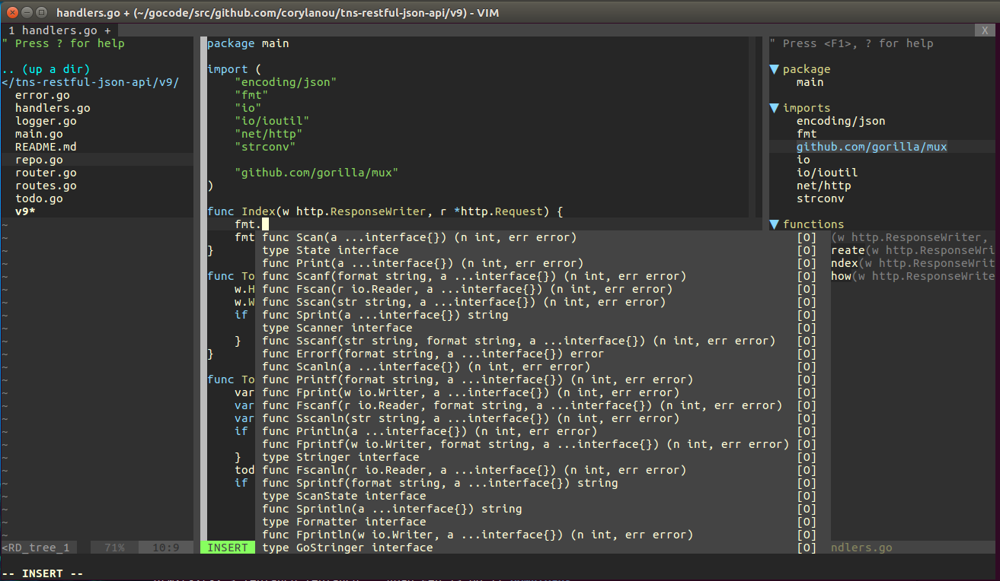

# Vim as a Go IDE

This project is an IDE for the Go language based on amix's most excellent [Ultimate Vimrc](https://github.com/amix/vimrc). In addition to the [terrific Vim plugins](https://github.com/amix/vimrc#included-plugins) that were included in [Ultimate Vimrc](https://github.com/amix/vimrc), the following packages were added:

* [neocomplete](https://github.com/Shougo/neocomplete.vim): Next generation completion framework
* [UltiSnips](https://github.com/SirVer/ultisnips): The ultimate snippet solution for Vim
* [Tagbar](https://github.com/majutsushi/tagbar): Displays tags in a window, ordered by scope
* [CSApprox](https://github.com/vim-scripts/CSApprox): Makes gvim-only colorschemes work transparently in terminal vim
* [Colour-Sampler-Pack](https://github.com/vim-scripts/Colour-Sampler-Pack): Top 100(ish) Vim colorschemes
* [ScrollColors](https://github.com/vim-scripts/ScrollColors): Colorsheme Scroller, Chooser, and Browser

# Sample Screen Shot
The following is a sample screen shot showing:

* Keyword auto-completion feature for some Go code in the center window
* Directory tree listing on the left
* Tags window on the right (similar to a table of contents)

# Requirements

## Vim with Lua Support
The neocomplete plugin [requires](https://github.com/Shougo/neocomplete) a version of Vim with Lua support. To see if your version includes Lua support, check for the "+lua" flag in the vim version information:

    vim --version | grep +lua

For Ubuntu, the following versions of Vim include Lua support (choice depends on your graphical environment):

    * vim-nox    (no GUI support)
    * vim-gtk
    * vim-gnome
    * vim-athena

For CentOS7, this [script](https://github.com/diverdane/vim-compile-centos7) can be used to compile a version of Vim with Lua support.

## Exuberant Ctags
The TagBar plugin [requires](https://github.com/majutsushi/tagbar#dependencies) the [Exuberant version of Ctags](http://ctags.sourceforge.net/). To check whether your current Ctags is the exuberant version:

    ctags --version | grep Exuberant

To install Exuberant Ctags on Ubuntu:

     cd ~/Downloads
     wget https://sourceforge.net/projects/ctags/files/ctags/5.8/ctags-5.8.tar.gz
     tar -xzf ctags-5.8.tar.gz
     cd ctags-5.8
     ./configure
     make
     sudo make install

# Installation Instructions
To install, run the following commands:

    git clone https://github.com/diverdane/vim-go-ide.git ~/.vim_runtime
    ~/.vim_runtime/install.sh

This will clone the repository, and set up ~/.vimrc to use the new ~/.vim_runtime directory (a backup copy of ~/.vimrc will be created). Next, start up Vim and enter the following to ensure that your Go development environment includes the necessary binaries (and updates) upon which Vim depends:

    :GoInstallBinaries
    :GoUpdateBinaries

Optionally, create an alias (e.g. in ~/.bashrc or .bash_aliases) for vi:

    alias vi=vim
    export EDITOR=vim

# Function Key Mapping
The following function key mappings were added for convenience. These mappings can be displayed in Vim by pressing \<F7\>:

    <F2>      Directory tree window (open/close)
    <F3>      Line numbering (on/off)
    <F4>      Go to definition for a Go function, struct, etc.
    <F5>      Show callers for a Go function
    <S-F5>    Set scope (top directory) for Go callers search
    <F6>      Show callstack(s) for a Go function
    <F7>      Show this function key mapping info
    <F8>      Tag bar window (open/close)
    <F9>      Show Go snippets
    <F10>     Show Go key mappings
    <F11>     Maximize/minimize window
    <F12>     Scroll through installed Vim colorschemes

# Go-Specific Key Mappings
The following Go-specific key mappings were added. All but the last are only effective when editing a Go file. These mappings can be displayed by pressing \<F10\>:

    Sequence  Function       Description
    ========  ========       ===========
       K       doc           Show documentation for item under the cursor
       gd      def           Jump to definition/declaration
      ,r       run           Runs 'go run'
      ,b       build         Runs 'go build', does not create result file
      ,B       make          Runs 'go build', creates result file
      ,t       test          Runs 'go test'
      ,c       coverage      Runs 'go test -coverprofile-temp.out'
      ,dd      def           Jump to definition
      ,ds      def-split     Jump to definition in a split window
      ,dv      def-vertical  Jump to definition in a vertical split window
      ,dt      def-tab       Jump to definition in a tab window
      ,kk      doc           Show documentation for item under cursor
      ,kv      doc-vertical  Show documentation in vertical split window
      ,kb      doc-browser   Show documentation in a browser
      ,im      implements    Show interfaces that a type implements
      ,in      info          Show type info for item under the cursor
      ,e       rename        Rename the identifier at cursor (throughout package)
      ,P       GoPlay        Share snippet to play.golang.org and open browser
      ,T       NERDTreeFind  Display the current file in a directory tree

# Go-Specific Snippets
The following Go-specific snippets are included. These snippets are only in effect while editing Go files, and can be displayed by pressing the \<F9\> key. To use a snippet, while in insert mode type the sequence shown below followed by a \<Tab\>, and a snippet of code will be inserted:

         Sequence
    (Follow with <Tab>)       Snippet Inserted
    ===================   ========================
            :             v := value
            anon          fn := func() { ... }
            ap            append(slice, value)
            ap=           a = append(a, value)
            br            break
            ch            chan Type
            case          case ...:
            con           const XXX Type = ...
            cons          const ( ... )
            iota          const ( ... = iota )
            cn            continue
            default       default: ...
            df            defer someFunction()
            def           defer func() { ... }
            defr          defer with recover
            gpl           GNU Public License
            import        import ( ... )
            interface     interface I { ... }
            if            if ... { ... }
            else          else { ... }
            errn          Error return  !b
            errn,         Error return with two return values !b
            errp          Error panic !b
            errt          Error test fatal  !b
            errh          Error handle and return !b
            json          \`json:key\`
            yaml          \`yaml:key\`
            ft            fallthrough
            for           for ... { ... }
            fori          for 0..N-1 { ... }
            forr          for k, v := range items { ... }
            func          func Function(...) [error] { ... }
            ff            fmt.Printf(...)
            fn            fmt.Println(...)
            lf            log.Printf(...)
            ln            log.Println(...)
            make          make(Type, size)
            map           map[Type]Type
            main          func main() { ... }
            meth          func (self Type) Method(...) [error] { ... }
            ok            if !ok { ... }
            package       package ...
            pn            panic()
            rt            return
            select        select { case a := <-chan: ... }
            st            type T struct { ... }
            switch        switch x { ... }
            sp            fmt.Sprintf(...)
            go            go someFunc(...)
            gof           go func() { ... }()
            test          func TestXYZ(t *testing.T) { ... }
            hf            http.HandlerFunc !b
            hhf           mux.HandleFunc !b
            tsrv          httptest.NewServer
            ter           if err != nil { t.Errorf(...) }
            terf          if err != nil { t.Fatalf(...) }
            example       func ExampleXYZ() { ... }
            benchmark     func BenchmarkXYZ(b *testing.B) { ... }
            var           var x Type [= ...]
            vars          var ( ... )
            eq            equals: test two identifiers with DeepEqual

# Setting the Scope (Top Directory) for Go Callers Search
By default, the :GoCallers command (which can also be initiated via \<F5\>) searches for all callers to the current Go function only within the current package. For large, multiple-package projects, it's desirable to expand the search to look for callers outside of the current package. This can be accomplished dynamically either by using the :GoGuruScope command, or by navigating within the directory tree window (see next section) to the desired top directory (or bookmark), and
selecting \<S-F5\> (shifted F5 function key).

It should be noted that you don't want to set the search scope too arbitrarily large, since searches across larger scopes will take longer to complete.

# Navigating in the Directory Tree Window:
The \<F2\> function key can be used to toggle the directory tree window open/closed. The directory tree window can also be opened for the current file by entering ",T" while editing the file. Here are a few key sequences to help navigate in the directory tree window:

         <F2>         Turn directory tree window on/off
        <S-F5>        Set scope (root directory) for Go callers search
        <Enter>       Open current selection
           u          Move up to parent directory
           C          Change directory into current selection
           B          Toggle bookmark listings on/off
    :Bookmark <name>  Bookmark the current selection with specified name
    :Bookmark         Bookmark the current selection using dir/file name
    <Double-Click>    Expand selected directory or open selected file
    :help NERDTree    View documentation for NERDTree

# Navigating in the Tagbar
The \<F8\> function key can be used to toggle the Tagbar window open/closed. To view documentation for Tagbar, enter the following while in Vim:

    :help TagBar

# The vim-go Plugin and Tutorial
Documentation for the vim-go plugin can be viewed by entering the following from within Vim:

    :help vim-go

The vim-go [tutorial](https://github.com/fatih/vim-go-tutorial) can be found here: https://github.com/fatih/vim-go-tutorial

# Information on Other Plugins Included with vimrcPlugin
Documentation for the vimrc project can be viewed by entering the following from within Vim:

    :help vimrc

# Browsing Colorshemes
Don't like the colorscheme that's included? You can browse through over 100 colorschemes by pressing \<F12\> and scrolling using the arrow keys. If you find one that you prefer, you can set it as your default colorscheme by adding a 'colorscheme \<your-choice\>' entry in **~/.vim_runtime/my_configs.vim**.

# How to Modify Mappings, Colors, Behavior, etc.
If you'd like to make changes to key mappings, colorschemes, or any behavior, you can add settings to **~/.vim_runtime/my_configs.vim** file. You can also install your own plugins by cloning the plugins to the **~/.vim_runtime/sources_non_forked** directory (pathogen will automatically detect and install the new plugins.

# How to uninstall
Do the following:
* Remove `~/.vim_runtime`
* Remove any lines that refernce `.vim_runtime` in your `~/.vimrc`

